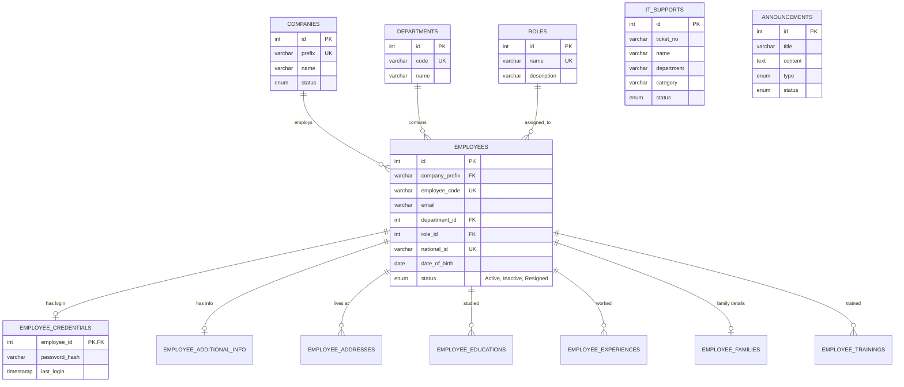

# Database Schema & ER Diagram

## Overview
ฐานข้อมูลนี้ถูกออกแบบมาเพื่อรองรับระบบ HR (Human Resources) แบบครบวงจร และมีส่วนขยายสำหรับระบบแจ้งปัญหาไอทีและประกาศข่าวสาร

## Entity-Relationship (ER) Diagram

## Tables Description

### Core Entities
- **`companies`**: เก็บข้อมูลบริษัท (เช่น AEP, AGC) ใช้ `prefix` เป็นรหัสอ้างอิง
- **`departments`**: แผนกในองค์กร
- **`roles`**: กำหนดสิทธิ์ผู้ใช้งาน เช่น Admin (1), HR (2), Employee (3)
- **`positions`**: ข้อมูลชื่อตำแหน่ง

### Employee Data (One-to-One / One-to-Many)
- **`employees`**: ตารางศูนย์กลาง เก็บข้อมูลพื้นฐานที่สำคัญของพนักงาน
- **`employee_credentials`**: (1:1) แยกรหัสผ่านออกจากการดึงข้อมูลปกติเพื่อความปลอดภัย ใช้ร่วมกับ Bcrypt
- **`employee_additional_info`**: (1:1) ข้อมูลทักษะเฉพาะด้าน ความสามารถพิเศษ
- **`employee_families`**: (1:1) ข้อมูลบิดา มารดา บุตร และผู้ติดต่อฉุกเฉิน
- **`employee_addresses`**: (1:N) ที่อยู่ตามทะเบียนบ้าน และที่อยู่ปัจจุบัน
- **`employee_educations`**: (1:N) ประวัติการศึกษา
- **`employee_experiences`**: (1:N) ประวัติการทำงานก่อนหน้า
- **`employee_trainings`**: (1:N) ประวัติการเข้าฝึกอบรม

### Utility Tables
- **`it_supports`**: ระบบ Helpdesk เก็บข้อมูลการแจ้งปัญหาไอที
- **`announcements`**: ระบบกระจายข่าวสารภายในองค์กร
