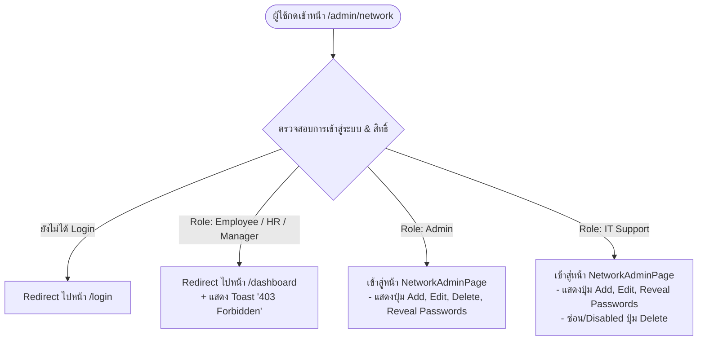
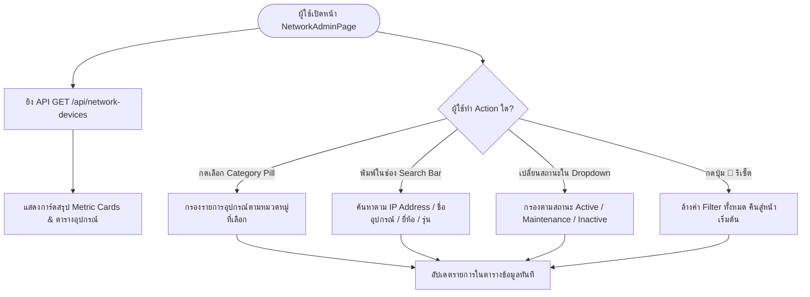
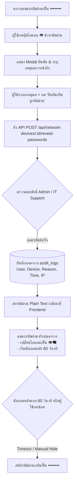
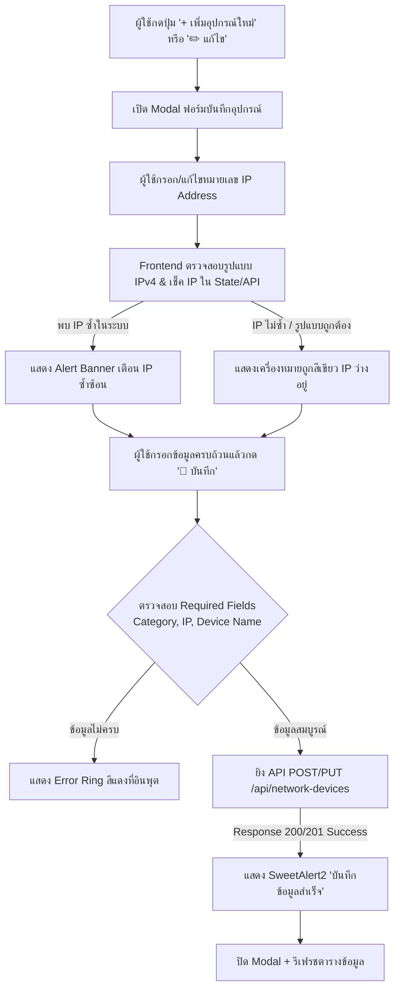

# Design Specification
## โมดูล: ระบบจัดการเครือข่ายและเซิร์ฟเวอร์ (Network & Infrastructure Management)
**Route Target:** `/admin/network`  
**Component:** `NetworkAdminPage.jsx`  
**ระบบหลัก:** ASCG Enterprise Portal  
**วันที่จัดทำ:** 11 สิงหาคม 2026  
**เวอร์ชัน:** 1.0.0  
**ผู้จัดทำ:** UX/UI Designer  

---

## 🎨 1. แนวคิดการออกแบบและระบบธีม (Design Concept & Hybrid Comfort Theme)

### 1.1 แนวคิดหลัก (Design Philosophy)
ระบบจัดการเครือข่ายและเซิร์ฟเวอร์เป็นเครื่องมือสำคัญสำหรับผู้ดูแลระบบ (System Administrators) และฝ่ายไอที (IT Support) ที่ต้องทำความเข้าใจโครงสร้างเครือข่าย IP Address และรหัสผ่านอุปกรณ์อย่างแม่นยำ ปลอดภัย และรวดเร็ว 

การออกแบบหน้านี้จึงเน้นหลักการ **"Security-First & Data-Dense Clarity"** โดยนำแนวทาง **Hybrid Comfort Theme** ของ ASCG Enterprise Portal มาประยุกต์ใช้เพื่อมอบประสบการณ์ผู้ใช้ที่ดีที่สุด:
1. **High Visual Hierarchy & Contrast**: อ่านข้อมูลตารางขนาดใหญ่ (Data-dense table) ได้ง่าย สบายตา ลดความเมื่อยล้าของการเพ่งหน้าจอคอมพิวเตอร์ตลอดวัน
2. **Security-Conscious Password Masking**: รหัสผ่านและ Access Key ปิดซ่อนเป็นความลับโดย default (`••••••••`) และมีปุ่มสลับการมองเห็น (Show/Hide Toggle) ที่แสดงเจตนาและมีการบันทึก Audit Log ชัดเจน
3. **Instant Filterability**: เข้าถึงอุปกรณ์ตามประเภท (Category Filter Pills 7 หมวดหมู่) และการค้นหา IP Address/ยี่ห้อรุ่น ได้ทันทีในคลิกเดียว

---

### 1.2 สเปกโทนสีและ Design Tokens (Hybrid Comfort Palette)

| Token Name | Hex Code | Tailwind Class | การใช้งานในหน้าจอ NetworkAdminPage |
|---|---|---|---|
| **Canvas Background** | `#f8fafc` | `bg-slate-50` | พื้นหลังหลักของหน้าจอทั้งหมด |
| **Primary Accent (Brand)** | `#f89919` | `bg-[#f89919]`, `text-[#f89919]` | ปุ่มหลัก `+ เพิ่มอุปกรณ์ใหม่`, Active Filter Pill, Focus Ring |
| **Primary Hover** | `#d97c08` | `hover:bg-[#d97c08]` | สถานะ Hover ของปุ่มหลักส้ม |
| **Secondary Accent** | `#ae8a68` | `bg-[#ae8a68]`, `text-[#ae8a68]` | ปุ่มรอง, Subtext, Highlight Sub-elements |
| **Surface Card** | `#ffffff` | `bg-white` | พื้นหลังการ์ดสรุป, พื้นหลังตารางข้อมูล, พื้นหลัง Modal |
| **Border / Divider** | `#e2e8f0` | `border-slate-200` | เส้นขอบตาราง, เส้นแบ่ง Section, ขอบการ์ด |
| **Text Primary** | `#0f172a` | `text-slate-900` | หัวข้อหลัก (Title), ข้อมูลในตาราง, ข้อความเน้น |
| **Text Secondary** | `#475569` | `text-slate-600` | ข้อความอธิบายรอง, Label ของอินพุต, Subtitle |
| **Text Muted** | `#94a3b8` | `text-slate-400` | Placeholder, Disabled states, Icons inactive |

---

### 1.3 สเปกสีประจำหมวดหมู่อุปกรณ์ (Category Color Badges & Pills)

เพื่อการแยกแยะหมวดหมู่อุปกรณ์เครือข่ายด้วยสายตาอย่างรวดเร็ว (Visual Scanning) ได้กำหนด Palette สีเฉพาะสำหรับ 7 หมวดหมู่ดังนี้:

| Category Key | ชื่อหมวดหมู่ | Badge Color (Bg / Text / Border) | Tailwind Classes |
|---|---|---|---|
| `Server` | เครื่องเซิร์ฟเวอร์ & Storage | 🟣 Indigo Soft | `bg-indigo-50 text-indigo-700 border-indigo-200` |
| `Network & Security` | อุปกรณ์เครือข่าย & Firewall | 🔵 Blue Soft | `bg-blue-50 text-blue-700 border-blue-200` |
| `Access Point` | จุดเชื่อมต่อไร้สาย (Wi-Fi AP) | 🟢 Emerald Soft | `bg-emerald-50 text-emerald-700 border-emerald-200` |
| `Printer` | เครื่องพิมพ์เอกสาร | 🟠 Amber Soft | `bg-amber-50 text-amber-700 border-amber-200` |
| `VoIP & Time Access` | ระบบบันทึกเวลา & โทรศัพท์ | 🔷 Teal Soft | `bg-teal-50 text-teal-700 border-teal-200` |
| `CCTV` | กล้องวงจรปิด | 🟣 Purple Soft | `bg-purple-50 text-purple-700 border-purple-200` |
| `Other` | อุปกรณ์อื่นๆ / สำรอง | ⚪ Slate Soft | `bg-slate-100 text-slate-700 border-slate-200` |

---

### 1.4 ระบบการแสดงผลสถานะอุปกรณ์ (Status Indicators)

* 🟢 **Active (เปิดใช้งานปกติ):** `bg-emerald-100 text-emerald-800 border-emerald-300` (ไอคอนจุดสีเขียวสว่าง `bg-emerald-500`)
* 🟡 **Maintenance (อยู่ระหว่างซ่อมบำรุง):** `bg-amber-100 text-amber-800 border-amber-300` (ไอคอนจุดสีส้ม `bg-amber-500`)
* 🔴 **Inactive (ยกเลิกใช้งาน/สำรอง):** `bg-slate-100 text-slate-600 border-slate-300` (ไอคอนจุดสีเทา `bg-slate-400`)

---

## 📐 2. โครงสร้างเค้าร่างหน้าจอ (Wireframe & Page Layout)

หน้าจอ `NetworkAdminPage.jsx` ถูกแบ่งออกเป็น **4 ส่วนหลัก** เรียงลำดับตาม Visual Hierarchy จากบนลงล่าง:
1. **Header & Executive Metric Cards**: แสดงชื่อหน้า ปรับปรุงล่าสุด ปุ่มเพิ่มอุปกรณ์ และการ์ดสรุปภาพรวม 4 ด้าน
2. **Category Filter Pills & Global Search Bar**: แถบเลือกหมวดหมู่ 7 ประเภท และช่องค้นหา IP/Keyword แบบ Real-time
3. **Network Device Data Table**: ตารางแสดงรายการอุปกรณ์ IP Address พร้อมปุ่ม Show/Hide Password Toggle
4. **Pagination & Footer Summary**: ตัวจัดการเปลี่ยนหน้า และสรุปจำนวนรายการ

---

### 2.1 Visual Wireframe Overview (ASCII Representation)

```text
+---------------------------------------------------------------------------------------------------------+
| [ASCG Enterprise Portal - Network & Infrastructure Management]                     [User Profile / Role]|
+---------------------------------------------------------------------------------------------------------+
|                                                                                                         |
| 🖥️ ระบบจัดการเครือข่ายและเซิร์ฟเวอร์ (Network Management)                                                |
| จัดการฐานข้อมูลอุปกรณ์ไอที IP Address และรหัสผ่านผู้ดูแลระบบในองค์กร                     [+ เพิ่มอุปกรณ์ใหม่]  |
|                                                                                                         |
| +-------------------+  +-------------------+  +-------------------+  +-------------------+              |
| | 🌐 อุปกรณ์ทั้งหมด  |  | 🖥️ เซิร์ฟเวอร์     |  | 📶 Access Point   |  | printer เครื่องพิมพ์    |              |
| | 45 รายการ         |  | 7 เครื่อง         |  | 9 จุดบริการ       |  | 14 เครื่อง        |              |
| | Active: 42        |  | DC, DNS, QNAP     |  | TP-Link, Cisco    |  | HP, Brother, Canon|              |
| +-------------------+  +-------------------+  +-------------------+  +-------------------+              |
|                                                                                                         |
| ------------------------------------------------------------------------------------------------------- |
| [Category Filter Pills]                                                                                 |
| ( ทั้งหมด 45 ) [ Server 7 ] [ Network&Sec 5 ] [ Access Point 9 ] [ Printer 14 ] [ VoIP&Time 4 ] [ CCTV 1 ] [ Other 5 ]
|                                                                                                         |
| 🔍 [ ค้นหาตาม IP Address, ชื่ออุปกรณ์, ยี่ห้อ, รุ่น...                    ] [สถานะ: ทั้งหมด ▾] [🔄 รีเซ็ต] |
| ------------------------------------------------------------------------------------------------------- |
|                                                                                                         |
| +-----------------------------------------------------------------------------------------------------+ |
| | IP Address     | อุปกรณ์ / รุ่น           | หมวดหมู่      | บัญชี / SSID   | รหัสผ่าน / Key   | ช่องทางจัดการ| สถานะ   | Action | |
| +-----------------------------------------------------------------------------------------------------+ |
| | 192.168.99.1   | DC Server / DNS          | [ Server ]   | Administrator | •••••••• [👁️]   | Web / vSphere| 🟢Active| [✏️][🗑️]| |
| |                | DELL PowerEdgeR310       |              |               | (Revealed)      |              |         |        | |
| | 192.168.99.241 | Access Point A-F1        | [AccessPoint]| AIA-WiFi      | •••••••• [👁️]   | Unifi Manage | 🟢Active| [✏️][🗑️]| |
| |                | TP-Link EAP610           |              | Key: •••••••• |                 |              |         |        | |
| | 192.168.99.254 | Firewall FGT-60E         | [Network&Sec]| admin         | •••••••• [👁️]   | FortiCloud   | 🟢Active| [✏️][🗑️]| |
| |                | Fortigate FGT-60E        |              | itd@ascg...   |                 |              |         |        | |
| | 192.168.99.22  | CCTV HQ                  | [ CCTV ]     | admin         | •••••••• [👁️]   | 9-Dot Pattern| 🟢Active| [✏️][🗑️]| |
| |                | HiKvision DS-7332HQHI    |              | S/N: DS-7332..|                 |              |         |        | |
| +-----------------------------------------------------------------------------------------------------+ |
|                                                                                                         |
|  แสดง 1 - 10 จาก 45 รายการ                                         [< ก่อนหน้า] [ 1 ] [ 2 ] [ 3 ] [ ถัดไป >]  |
|                                                                                                         |
+---------------------------------------------------------------------------------------------------------+
```

---

## 🏷️ 3. การออกแบบ Filter Pills หมวดหมู่ (Category Filter System)

ระบบกรองข้อมูลแบบ Filter Pills ออกแบบขึ้นเพื่อตอบโจทย์การค้นหาแบบ **1-Click Filter** ช่วยให้ผู้ดูแลระบบคลิกเลือกหมวดหมู่ที่ต้องการดูได้ทันทีโดยไม่ต้องเปิด Dropdown

```
               +-----------------------------------------------------------------------+
               |  (ทั้งหมด 45)  [Server 7]  [Network & Security 5]  [Access Point 9]   |
               |  [Printer 14]  [VoIP & Time Access 4]  [CCTV 1]  [Other 5]            |
               +-----------------------------------------------------------------------+
```

### 3.1 สเปกของ Filter Pills ทั้ง 8 สถานะ

1. **Pill "ทั้งหมด" (All):**
   * **Active State:** `bg-[#f89919] text-white shadow-sm font-semibold border-[#f89919]`
   * **Inactive State:** `bg-white text-slate-700 hover:bg-slate-100 border-slate-200`
   * **Count Badge:** แสดงตัวเลขจำนวนรวมอุปกรณ์ทั้งหมด (เช่น `45`)

2. **Pill "Server":**
   * **Active State:** `bg-indigo-600 text-white shadow-sm font-semibold border-indigo-600`
   * **Inactive State:** `bg-white text-slate-700 hover:bg-indigo-50 hover:text-indigo-600 border-slate-200`
   * **Icon:** `<Server className="w-4 h-4 mr-1.5" />`

3. **Pill "Network & Security":**
   * **Active State:** `bg-blue-600 text-white shadow-sm font-semibold border-blue-600`
   * **Inactive State:** `bg-white text-slate-700 hover:bg-blue-50 hover:text-blue-600 border-slate-200`
   * **Icon:** `<ShieldCheck className="w-4 h-4 mr-1.5" />`

4. **Pill "Access Point":**
   * **Active State:** `bg-emerald-600 text-white shadow-sm font-semibold border-emerald-600`
   * **Inactive State:** `bg-white text-slate-700 hover:bg-emerald-50 hover:text-emerald-600 border-slate-200`
   * **Icon:** `<Wifi className="w-4 h-4 mr-1.5" />`

5. **Pill "Printer":**
   * **Active State:** `bg-amber-600 text-white shadow-sm font-semibold border-amber-600`
   * **Inactive State:** `bg-white text-slate-700 hover:bg-amber-50 hover:text-amber-600 border-slate-200`
   * **Icon:** `<Printer className="w-4 h-4 mr-1.5" />`

6. **Pill "VoIP & Time Access":**
   * **Active State:** `bg-teal-600 text-white shadow-sm font-semibold border-teal-600`
   * **Inactive State:** `bg-white text-slate-700 hover:bg-teal-50 hover:text-teal-600 border-slate-200`
   * **Icon:** `<Clock className="w-4 h-4 mr-1.5" />`

7. **Pill "CCTV":**
   * **Active State:** `bg-purple-600 text-white shadow-sm font-semibold border-purple-600`
   * **Inactive State:** `bg-white text-slate-700 hover:bg-purple-50 hover:text-purple-600 border-slate-200`
   * **Icon:** `<Video className="w-4 h-4 mr-1.5" />`

8. **Pill "Other":**
   * **Active State:** `bg-slate-700 text-white shadow-sm font-semibold border-slate-700`
   * **Inactive State:** `bg-white text-slate-700 hover:bg-slate-100 border-slate-200`
   * **Icon:** `<Box className="w-4 h-4 mr-1.5" />`

---

### 3.2 แถบค้นหาและตัวกรองเสริม (Search Bar & Secondary Filters)

ถัดจากแถบ Filter Pills จะมีแถบเครื่องมือค้นหาเพื่อความรวดเร็วในการสืบค้น:

* **Global Search Input:**
  * Placeholder: `"ค้นหาตาม IP Address (เช่น 192.168.99.1), ชื่ออุปกรณ์, ยี่ห้อ, รุ่น..."`
  * Leading Icon: `<Search className="text-slate-400 w-4 h-4 absolute left-3 top-3" />`
  * Features: มีปุ่ม `[X]` ล้างคำค้นหาเมื่อผู้ใช้พิมพ์ข้อความ
* **Status Filter Dropdown:**
  * ตัวเลือก: `สถานะทั้งหมด`, `🟢 Active (ใช้งานอยู่)`, `🟡 Maintenance (ซ่อมบำรุง)`, `🔴 Inactive (ยกเลิก)`
* **Reset Filter Button:**
  * ปุ่ม `[🔄 รีเซ็ตตัวกรอง]` (เมื่อมีการเลือก Filter ค้างไว้ เพื่อคืนค่ากลับสู่หน้าเริ่มต้น)

---

## 📊 4. ตารางข้อมูลและปุ่ม Show/Hide Password Toggle

ตารางข้อมูลเป็นองค์ประกอบหลักที่จัดแสดงโครงสร้าง IP Address และ Credential อุปกรณ์เครือข่าย

```text
+--------------------------------------------------------------------------------------------------------------------------+
| IP Address     | ข้อมูลอุปกรณ์ & รุ่น        | หมวดหมู่       | Login / SSID         | Password / Access Key  | ช่องทางจัดการ | สถานะ   | จัดการ  |
+--------------------------------------------------------------------------------------------------------------------------+
| 192.168.99.1   | DC Server / DNS           | [ Server ]    | Administrator        | •••••••• [👁️]         | Web vSphere  | 🟢Active| [✏️] [🗑️]|
|                | DELL PowerEdgeR310        |               |                      |                       |              |         |         |
| 192.168.99.254 | Firewall FGT-60E          | [Network&Sec] | admin                | •••••••• [👁️]         | FortiCloud   | 🟢Active| [✏️] [🗑️]|
|                | Fortigate FGT-60E         |               | itd@ascggroup.com    | Key: •••••••• [👁️]    |              |         |         |
+--------------------------------------------------------------------------------------------------------------------------+
```

### 4.1 สเปกคอลัมน์ในตาราง (Table Columns Specification)

1. **IP Address (Font: Monospace `font-mono`):**
   * แสดงหมายเลข IP Address ตัวหนา เช่น `192.168.99.1`
   * หากเป็น IP Reserve หรือ Range จะแสดง Badge ไฮไลท์พิเศษ
2. **ข้อมูลอุปกรณ์ & รุ่น (Device Name & Brand/Model):**
   * แถวบน: ชื่ออุปกรณ์ (`device_name`) สี slate-900 ตัวหนา
   * แถวล่าง: ยี่ห้อ และ รุ่น (`brand_name` - `model`) สี slate-500 ขนาดเล็ก `text-xs`
3. **หมวดหมู่ (Category Badge):**
   * แสดง Badge สีตามสเปกหมวดหมู่ (Indigo, Blue, Emerald, Amber, Teal, Purple, Slate)
4. **Login User / SSID:**
   * แถวบน: บัญชีผู้ดูแลระบบ (`login_user`) หรือ SSID (`login_ssid`)
   * หากมีทั้งสองค่า จะจัดเรียงให้อ่านง่าย มีไอคอน `<User />` หรือ `<Wifi />` กำกับ
5. **Password & Access Key (กับปุ่ม Show/Hide Toggle):**
   * แสดงรหัสผ่านที่ซ่อนอยู่ (`••••••••`) พร้อมปุ่มกดไอคอนดวงตา `<Eye />`
   * หากกดเปิดเผย จะเปลี่ยนเป็นตัวอักษรจริง เช่น `@QAZxsw3` สีแดงเข้ม/ส้ม พร้อมไอคอน `<EyeOff />` และมีเวลานับถอยหลัง 60 วินาที
6. **ช่องทางบริหารจัดการ (Manage Program / Link):**
   * หากเป็น URL หรือ IP จะแสดงเป็น Hyperlink สามารถคลิกเปิด Tab ใหม่ได้ (`target="_blank"`) พร้อมไอคอน `<ExternalLink className="w-3 h-3 ml-1 text-blue-500" />`
7. **สถานะ (Status Badge):**
   * แสดง Badge ระบุสถานะ Active (เขียว), Maintenance (ส้ม), Inactive (เทา)
8. **การจัดการ (Actions Column):**
   * ปุ่มแก้ไข `[✏️ Edit]`: แสดงสำหรับสิทธิ์ `Admin` และ `IT Support`
   * ปุ่มลบ `[🗑️ Delete]`: แสดง**เฉพาะสิทธิ์ `Admin`** เท่านั้น (หากเป็น `IT Support` ปุ่มจะถูกซ่อน หรือขึ้น Disabled พร้อม Tooltip)

---

### 4.2 สเปกรายละเอียดฟีเจอร์ Show/Hide Password Toggle

เพื่อความปลอดภัยขั้นสูง (Cybersecurity Compliance) ปุ่มสลับการซ่อน/เปิดรหัสผ่านถูกออกแบบตามกฎดังนี้:

```text
[สถานะปกติ (Default State)]
Login Password:  ••••••••   [ 👁️ ]  <-- Tooltip: "กดเพื่อขอเปิดดูรหัสผ่าน"

[ขั้นตอนเมื่อกดปุ่ม 👁️]
   ▼
[แสดง Modal ระบุเหตุผล (เฉพาะการเข้าถึงแบบบันทึก Audit)]
┌─────────────────────────────────────────────────────────────┐
│ 🔑 ยืนยันการขอเปิดดูรหัสผ่านอุปกรณ์ (Audit Log Notice)      │
│ อุปกรณ์: DC Server / DNS (192.168.99.1)                      │
│                                                             │
│ กรุณาระบุเหตุผลการเข้าถึงรหัสผ่าน:                          │
│ [ ต้องการเข้าปรับตั้งค่าพอร์ต Router ใหม่                ]   │
│                                                             │
│ [ ยกเลิก ]                             [ ยืนยันเปิดดูรหัสผ่าน ]│
└─────────────────────────────────────────────────────────────┘
   ▼
[สถานะหลังเปิดดูรหัสผ่าน (Revealed State - มีผล 60 วินาที)]
Login Password:  @QAZxsw3   [ 👁️‍🗨️ ] (ซ่อนอัตโนมัติใน 58s)
```

#### คุณสมบัติหลักของ Show/Hide Password:
1. **Default State**: ทุกคอลัมน์ Password และ Key Access จะถูกแสดงผลเป็น `••••••••` โดยไม่มีการส่ง Plain Text Password มากับ GET List API เพื่อป้องกันการดักจับแพ็กเก็ต (Packet Sniffing)
2. **Interactive Reveal Request**: เมื่อผู้ใช้กดปุ่มดวงตา `[👁️]` ระบบ Frontend จะเรียก API `POST /api/network-devices/:id/reveal-passwords`
3. **Audit Log Recording**: ระบบ Backend บันทึก log การขอเปิดดูรหัสผ่านโดยอัตโนมัติ (ประกอบด้วย ผู้ใช้, ID อุปกรณ์, เหตุผล, เวลา และ IP เครื่องผู้ใช้)
4. **Auto Re-masking Timer**: เมื่อรหัสผ่านเปิดเผยแล้ว จะมีตัวนับถอยหลัง 60 วินาที (`60s Auto Re-mask Count`) หากผู้ใช้ไม่กดยกเลิก รหัสผ่านจะสลับกลับไปเป็น `••••••••` โดยอัตโนมัติเพื่อป้องกันการเปิดรหัสผ่านทิ้งไว้บนหน้าจอ

---

## 📝 5. Modal ฟอร์มสำหรับ เพิ่ม/แก้ไข อุปกรณ์เครือข่าย

Modal ฟอร์มถูกออกแบบให้มีโครงสร้างแบบ **2-Column Responsive Layout** รองรับการกรอกข้อมูลอย่างรวดเร็ว พร้อมระบบตรวจสอบ IP Address ซ้ำแบบ Real-time

```text
┌──────────────────────────────────────────────────────────────────────────────────────────────┐
│ 🖥️ เพิ่มอุปกรณ์เครือข่ายใหม่ (Add Network Device)                                      [ X ]│
├──────────────────────────────────────────────────────────────────────────────────────────────┤
│                                                                                              │
│  หมวดหมู่อุปกรณ์ *                                                                             │
│  [ Select Category: Access Point                      ▾ ]                                    │
│                                                                                              │
│  หมายเลข IP Address *                                ชื่ออุปกรณ์ / หน้าที่การทำงาน *              │
│  [ 192.168.99.50                                      ] [ Access Point Office ชั้น 2        ] │
│  ⚠️ IP Address นี้ว่างอยู่ (สามารถใช้งานได้)                                                  │
│                                                                                              │
│  ยี่ห้อ (Brand)                                      รุ่น (Model)                            │
│  [ TP-Link                                            ] [ EAP610                            ] │
│                                                                                              │
│  บัญชีผู้ดูแลระบบ (Login User)                       รหัสผ่านผู้ดูแลระบบ (Login Password)     │
│  [ admin                                              ] [ ••••••••••••                 [👁️] ] │
│                                                                                              │
│  ชื่อสัญญาณ Wi-Fi (SSID) / Account                    รหัส Wi-Fi Key / Access Key             │
│  [ ASCG-Guest                                         ] [ ••••••••••••                 [👁️] ] │
│                                                                                              │
│  โปรแกรม/ช่องทางบริหารจัดการ                          วันที่จัดซื้อ (Purchase Date)            │
│  [ Unifi Manage Web Portal                            ] [ 2026-08-11                   [📅] ] │
│                                                                                              │
│  สถานะอุปกรณ์ *                                                                                │
│  (•) 🟢 Active (เปิดใช้งาน)    ( ) 🟡 Maintenance (ซ่อมบำรุง)    ( ) 🔴 Inactive (ยกเลิก)    │
│                                                                                              │
│  หมายเหตุเพิ่มเติม (Remark)                                                                    │
│  [ ติดตั้งบริเวณชั้น 2 โซนบัญชี สำหรับพนักงานและ Guest                                   ] │
│                                                                                              │
├──────────────────────────────────────────────────────────────────────────────────────────────┤
│                                                                        [ ยกเลิก ] [ 💾 บันทึก ]│
└──────────────────────────────────────────────────────────────────────────────────────────────┘
```

### 5.1 รายละเอียดฟิลด์และการตรวจสอบข้อมูล (Form Field Specs & Validations)

| Field Name | Input Type | Required | Helper Text / Validation Rule |
|---|---|---|---|
| **Category** | `Select` (Dropdown) | **Yes** | เลือก 1 ใน 7 หมวดหมู่หลัก |
| **IP Address** | `Input (Text/IPv4)` | **Yes** | รูปแบบ IPv4 เท่านั้น (เช่น `192.168.99.50`) **เช็ค IP ซ้ำทันทีที่พิมพ์/Blur** |
| **Device Name** | `Input (Text)` | **Yes** | ความยาว 2 - 255 ตัวอักษร (เช่น `DC Server / DNS`) |
| **Brand Name** | `Input (Text)` | No | ยี่ห้ออุปกรณ์ (เช่น `DELL`, `TP-Link`, `Brother`) |
| **Model** | `Input (Text)` | No | ชื่อรุ่น (เช่น `PowerEdgeR310`, `EAP610`) |
| **Login User** | `Input (Text)` | No | บัญชีผู้ดูแลระบบ (เช่น `root`, `admin`) |
| **Login Password**| `Input (Password)` | No | มีปุ่ม Eye Toggle ซ่อน/แสดงขณะพิมพ์ |
| **Login / SSID** | `Input (Text)` | No | ชื่อสัญญาณ Wi-Fi หรือ Domain User |
| **Access Key** | `Input (Password)` | No | รหัส Wi-Fi Key หรือ Serial Number |
| **Manage Program**| `Input (Text/URL)` | No | Web URL หรือชื่อโปรแกรมที่ใช้คุม |
| **Purchase Date** | `Input (Date)` | No | วันที่จัดซื้อ (YYYY-MM-DD) |
| **Status** | `Radio Buttons` | **Yes** | Default: `active` (Active, Maintenance, Inactive) |
| **Remark** | `Textarea` | No | หมายเหตุเพิ่มเติมหรือรายละเอียดเทคนิค |

---

### 5.2 การแสดงผลแจ้งเตือน IP Address ซ้ำซ้อน (Duplicate IP Warning UI)

หากผู้ใช้กรอกหมายเลข IP Address ที่มีอยู่ในระบบอยู่แล้ว ระบบจะแสดง **Alert Banner สีส้ม/เหลือง** ใต้ช่อง IP ทันทีโดยไม่ต้องรอให้กดบันทึก:

```text
┌─────────────────────────────────────────────────────────────────────────┐
│ ⚠️ คำเตือน: หมายเลข IP 192.168.99.1 ถูกใช้งานแล้วโดยอุปกรณ์             │
│    "DC Server / DNS" (หมวดหมู่: Server, สถานะ: Active)                  │
│    หากคุณต้องการลงทะเบียน IP นี้ กรุณาตรวจสอบให้แน่ใจว่าไม่ใช่ IP ซ้ำซ้อน   │
└─────────────────────────────────────────────────────────────────────────┘
```

---

## 🔄 6. ไดอะแกรมลำดับการทำงาน (User Flow Diagrams)

### 6.1 Flow การเข้าถึงหน้าจัดการเครือข่ายตามสิทธิ์ (RBAC Navigation Flow)



---

### 6.2 Flow การค้นหาและกรองข้อมูลอุปกรณ์ (Filter & Search Flow)



---

### 6.3 Flow ปุ่ม Show/Hide Password & การบันทึก Audit Log



---

### 6.4 Flow การเพิ่ม/แก้ไข อุปกรณ์และการตรวจสอบ IP ซ้ำ (Add/Edit Lifecycle Flow)



---

## 📱 7. การรองรับหน้าจอทุกขนาดและการเข้าถึง (Responsive & Accessibility)

### 7.1 Breakpoints & Layout Adaptations

| Screen Size | Breakpoint | การปรับเปลี่ยนเค้าร่าง UI (Layout Adaptations) |
|---|---|---|
| **Mobile** | `< 640px` (`sm`) | • การ์ดสรุป Metric Cards ปรับแสดงผลแบบ 2x2 Grid<br/>• Category Filter Pills สไลด์แนวนอนได้ (`overflow-x-auto`)<br/>• ตารางปรับเป็น Responsive Scroll แนวนอน หรือ Stacked Cards View |
| **Tablet** | `640px - 1024px` (`md`) | • การ์ดสรุป 4 ช่อง แถวเรียง 4 Columns<br/>• ฟอร์ม Modal ปรับเป็น 1 Column Layout เพื่อการพิมพ์ที่ถนัดบนแท็บเล็ต |
| **Desktop** | `> 1024px` (`lg`/`xl`) | • แสดงผล Full Multi-column Table พร้อม Sidebar เมนูเต็มรูปแบบ<br/>• ฟอร์ม Modal แสดงผลแบบ 2 Columns สมบูรณ์แบบ |

---

### 7.2 มาตรฐานการเข้าถึงสำหรับผู้พิการ (Accessibility - WCAG 2.1 AA Compliance)

1. **Color Contrast Ratio**: ทุกข้อความ ตัวหนังสือ และ Badges มีอัตราส่วนความต่างสี (Contrast Ratio) ไม่ต่ำกว่า **4.5:1** บนพื้นหลัง slate-50 / white
2. **Keyboard Navigation**:
   * รองรับการใช้ปุ่ม `Tab` และ `Shift + Tab` เลื่อนโฟกัสไปตาม Filter Pills, อินพุตฟอร์ม, และปุ่ม Show/Hide Password
   * กด `Esc` เพื่อปิด Modal ฟอร์มได้ทันที
3. **ARIA Attributes**:
   * ปุ่ม Show/Hide Password มี `aria-label="แสดงรหัสผ่านสำหรับ [ชื่ออุปกรณ์]"` และ `aria-expanded="false/true"`
   * ตารางข้อมูลมี `role="table"`, `aria-rowcount`, `aria-colcount` ถูกต้องตามมาตรฐาน HTML5 Accessibility

---

## 📋 8. สรุปรายการองค์ประกอบดีไซน์สำหรับนักพัฒนา (Developer Handoff Checklist)

* [x] **Page File Target**: `frontend/src/pages/NetworkAdminPage.jsx`
* [x] **Route Mapping**: เพิ่ม `/admin/network` ใน `App.jsx` และผูกสิทธิ์ `Admin`, `IT Support`
* [x] **Sidebar Link**: เพิ่มรายการเมนู "จัดการเครือข่าย & IP" ใน `AdminLayout.jsx`
* [x] **Icon Package**: ใช้ `lucide-react` (`Server`, `ShieldCheck`, `Wifi`, `Printer`, `Clock`, `Video`, `Box`, `Eye`, `EyeOff`, `Plus`, `Edit`, `Trash2`, `Search`, `RotateCcw`, `ExternalLink`, `Lock`)
* [x] **Alert Package**: ใช้ `sweetalert2` สำหรับยืนยันการลบอุปกรณ์ และแจ้งเตือนผลการบันทึก
* [x] **State Management**:
  * `devices` (รายการอุปกรณ์), `categories` (หมวดหมู่)
  * `selectedCategory` (Pill ที่เลือกอยู่)
  * `searchTerm` (ข้อความค้นหา), `statusFilter` (สถานะที่เลือก)
  * `revealedPasswords` (Object เก็บ State การเปิดดูรหัสผ่านชั่วคราวพร้อม Timer)
  * `isModalOpen`, `isEditMode`, `formData` (ข้อมูลฟอร์ม เพิ่ม/แก้ไข)

---

*เอกสารสเปกการออกแบบ UX/UI สำหรับโมดูลระบบจัดการเครือข่ายและเซิร์ฟเวอร์ (`/admin/network`) ฉบับนี้ จัดทำขึ้นโดยสมบูรณ์ พร้อมนำไปพัฒนาเป็น Component React (`NetworkAdminPage.jsx`) ได้ทันทีครับ!*
