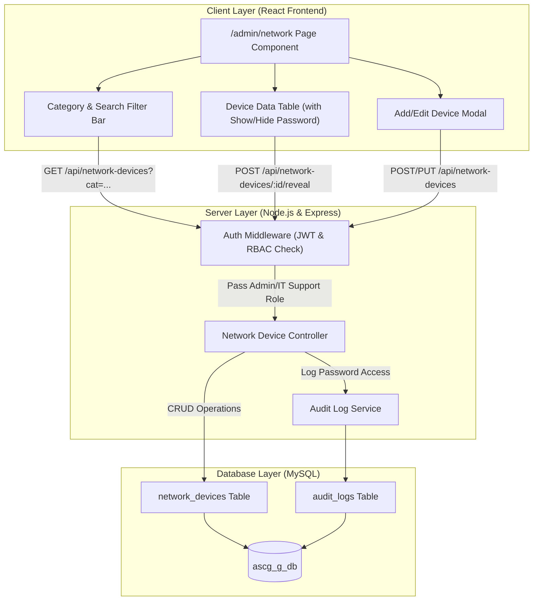

# Technical Specification
## โมดูล: ระบบจัดการเครือข่ายและเซิร์ฟเวอร์ (Network & Infrastructure Management)
**Route:** `/admin/network`  
**API Prefix:** `/api/network-devices`  
**ระบบหลัก:** ASCG Enterprise Portal  
**วันที่จัดทำ:** 11 สิงหาคม 2026  
**เวอร์ชัน:** 1.0.0  
**ผู้จัดทำ:** Business Analyst (BA) & Solution Architect  

---

## 📋 1. บทนำและวัตถุประสงค์ (Introduction & Purpose)

### 1.1 ภาพรวม (Overview)
โมดูล **"ระบบจัดการเครือข่ายและเซิร์ฟเวอร์ (Network & Infrastructure Management)"** (`/admin/network`) ถูกออกแบบขึ้นเพื่อเป็นระบบบริหารจัดการฐานข้อมูลอุปกรณ์เทคโนโลยีสารสนเทศ (IT Infrastructure Assets) และการจัดสรร IP Address ภายในองค์กร **ASCG Group** รวมศูนย์ข้อมูลเครื่องเซิร์ฟเวอร์ (Servers), อุปกรณ์เครือข่ายและความปลอดภัย (Firewall, Routers, Switches), จุดเชื่อมต่อไร้สาย (Access Points), เครื่องพิมพ์ (Printers), ระบบกล้องวงจรปิด (CCTV), และอุปกรณ์ลงเวลา/ระบบโทรศัพท์ (VoIP & Time Access)

### 1.2 ปัญหาของระบบเดิม (Legacy Pain Points)
1. **การจัดเก็บข้อมูลกระจายในไฟล์ Excel (`Book3.xlsx`)**: ทำให้ยากต่อการสืบค้น, ขาดการควบคุมเวอร์ชัน (Version Control) และเสี่ยงต่อการบันทึก IP Address ซ้ำซ้อน (IP Conflict)
2. **ความเสี่ยงด้านความปลอดภัยของรหัสผ่าน (Password Security & Access Exposure)**: รหัสผ่านผู้ดูแลระบบ (Admin Password), Wi-Fi Keys และ Access Keys ถูกเปิดเผยแบบ Plain Text บนไฟล์ Excel โดยไม่มีระบบจัดเก็บสิทธิ์และเปิดซ่อนรหัสผ่าน (Show/Hide Password)
3. **ขาดระบบ Audit Trail & Access Control**: ไม่มีบันทึกประวัติว่าใครเป็นผู้เข้าดูรหัสผ่าน หรือแก้ไขข้อมูลอุปกรณ์ไอทีในระบบ

### 1.3 วัตถุประสงค์ของระบบใหม่ (Objectives)
1. **Centralized IT Infrastructure Database**: รวมศูนย์การจัดเก็บข้อมูลอุปกรณ์ IP Address และ Credential ทั้งหมดไว้ในระบบ ASCG Enterprise Portal
2. **Advanced Filtering & Search**: ให้ผู้ดูแลระบบและฝ่ายไอทีสามารถค้นหาและกรองข้อมูลอุปกรณ์ตาม IP Address, หมวดหมู่ (Category), ยี่ห้อ/รุ่น, หรือ Keyword ได้อย่างรวดเร็ว
3. **Role-Based Access Control (RBAC) & Password Masking**: ควบคุมสิทธิ์เข้าถึงเฉพาะสิทธิ์ `Admin` และ `IT Support` พร้อมระบบซ่อนรหัสผ่าน (`••••••••`) และปุ่ม Toggle Show/Hide Password ที่ปลอดภัย
4. **Data Integrity & Exporting**: รองรับการตรวจสอบ IP ซ้ำ และสามารถส่งออก/จัดทำรายงานอุปกรณ์ได้อย่างแม่นยำ

---

## 📊 2. การวิเคราะห์ข้อมูลจากระบบเดิม (Legacy Data Analysis - `Book3.xlsx`)

จากการวิเคราะห์ไฟล์ข้อมูลอุปกรณ์ไอทีเดิมจาก `Book3.xlsx` (Sheet: `IP-Setting`) ข้อมูลโครงสร้างเครือข่ายปัจจุบันของ ASCG Group มีลักษณะดังนี้:

### 2.1 โครงสร้างวงเครือข่าย (Subnet Structure)
* **Subnet หลัก:** `192.168.99.0/24`
* **Static IP Reserved:** `192.168.99.1` – `192.168.99.45` และ `192.168.99.240` – `192.168.99.254`
* **DHCP Dynamic Range:** `192.168.99.46` – `192.168.99.239` (สำหรับเครื่องคอมพิวเตอร์พนักงานและอุปกรณ์พกพา)

### 2.2 สรุปการจัดหมวดหมู่อุปกรณ์ (Category Mapping)
จากการสำรวจแถวข้อมูลใน `Book3.xlsx` ข้อมูลถูกจัดกลุ่มออกเป็น **7 หมวดหมู่หลัก (Categories)** ดังนี้:

| หมวดหมู่ (Category Key) | ชื่อหมวดหมู่ (Display Name) | ตัวอย่างอุปกรณ์ในระบบเดิม (Book3.xlsx Data) | จำนวนประมาณการ |
|---|---|---|---|
| `Server` | เครื่องเซิร์ฟเวอร์ & ระบบจัดเก็บข้อมูล | DC Server / DNS (192.168.99.1), DNS2/Sharefiles (192.168.99.2), iDRAC (192.168.99.4), QNAP NAS (192.168.99.5), CRM_Server (192.168.99.11), Server DOC (192.168.99.14), VMware vSphere (192.168.99.30) | 7 รายการ |
| `Network & Security` | อุปกรณ์เครือข่าย & ไฟร์วอลล์ | Fortigate Firewall FGT-60E (192.168.99.254), Old Firewall 60C (192.168.99.24), TRENDnet Router (192.168.99.23), 3Com Core Switch (192.168.99.250), Fortigate Log Analyzer 100C (192.168.99.251) | 5 รายการ |
| `Access Point` | จุดเชื่อมต่อไร้สาย (Wi-Fi AP) | TP-Link EAP610 (A-F1, A-F2, A-F3, B-F1, B-F2, B-F3), TP-Link TL-WA1201 (192.168.99.167), Cisco WAP300N (192.168.99.240), DLink DIR-850L (192.168.99.247) | 9 รายการ |
| `Printer` | เครื่องพิมพ์เอกสาร | Epson (L565, L550, L6190, L6170, L6290), HP LaserJet M130FN, Brother (DCP-T700W, MFC-L3551CDW, MFC-L3750CDW), Canon (iR-ADV C3922, C3822, MF1333iF), Kyocera FS-1135 | 14 รายการ |
| `VoIP & Time Access` | ระบบบันทึกเวลา & โทรศัพท์ | ZKTeco Time Access V3L (192.168.99.7), ZKT X8 (192.168.99.249), NEC VoIP SL1000 (192.168.99.9, 192.168.99.10) | 4 รายการ |
| `CCTV` | กล้องวงจรปิด | HiKvision DS-7332HQHI-K4 (192.168.99.22) | 1 รายการ |
| `Other` | อุปกรณ์อื่นๆ / สำรอง | DHCP Dynamic Range, IP Reserve, VPN Gateways | 5 รายการ |

---

## 🗄️ 3. โครงสร้างฐานข้อมูล (Database Schema Specification)

เพื่อรองรับฟิลด์ข้อมูลทั้งหมดใน `Book3.xlsx` รวมถึงการบริหารจัดการสถานะและเวลา ตาราง `network_devices` จะถูกสร้างขึ้นในฐานข้อมูล `ascg_g_db` ตามรายละเอียดดังนี้:

### 3.1 Data Dictionary Table (`network_devices`)

| Field Name | Data Type | Nullable | Default | Description & Constraint | Mapping From Book3.xlsx |
|---|---|---|---|---|---|
| `id` | `INT AUTO_INCREMENT` | **NO** | `AUTO_INCREMENT` | Primary Key ประจำแถวข้อมูล | - |
| `ip_address` | `VARCHAR(45)` | **NO** | - | หมายเลข IP Address (IPv4/IPv6 หรือ String แสดงสถานะ IP) | Column `IP` |
| `device_name` | `VARCHAR(255)` | **NO** | - | ชื่ออุปกรณ์ หรือหน้าที่การทำงานของเครื่อง | Column `Device` |
| `brand_name` | `VARCHAR(100)` | YES | `NULL` | ยี่ห้อ/ผู้ผลิตอุปกรณ์ (เช่น DELL, TP-Link, Brother) | Column `Brand/Name` |
| `model` | `VARCHAR(100)` | YES | `NULL` | ชื่อรุ่น/Model ของอุปกรณ์ (เช่น PowerEdgeR310, EAP610) | Column `Model` |
| `login_user` | `VARCHAR(100)` | YES | `NULL` | บัญชีผู้ดูแลระบบ / Username ที่ใช้เข้าใช้งาน | Column `Login Admin` |
| `login_password` | `VARCHAR(255)` | YES | `NULL` | รหัสผ่านผู้ดูแลระบบ (จัดเก็บด้วย AES-256 Encryption/Plain Key) | Column `Password` |
| `manage_program` | `VARCHAR(255)` | YES | `NULL` | โปรแกรมหรือ URL ที่ใช้บริหารจัดการ (เช่น VMware, Web) | Column `Manage Program` |
| `login_ssid` | `VARCHAR(255)` | YES | `NULL` | ชื่อสัญญาณ Wi-Fi (SSID) หรือ Domain Account | Column `Login / SSID` |
| `access_key` | `VARCHAR(255)` | YES | `NULL` | รหัสผ่าน Wi-Fi Key หรือ Serial Number / Key Access | Column `Key Access` |
| `purchase_date` | `DATE` | YES | `NULL` | วันที่จัดซื้ออุปกรณ์ (YYYY-MM-DD) | Column `Pur.Date` |
| `category` | `ENUM(...)` | **NO** | `'Other'` | หมวดหมู่อุปกรณ์ (`Server`, `Network & Security`, `Access Point`, `Printer`, `VoIP & Time Access`, `CCTV`, `Other`) | Category Classification |
| `remark` | `TEXT` | YES | `NULL` | หมายเหตุเพิ่มเติม หรือรายละเอียดเทคนิค | Column `Remark` |
| `status` | `ENUM(...)` | **NO** | `'active'` | สถานะการใช้งาน (`active`, `inactive`, `maintenance`) | System Managed Status |
| `created_at` | `TIMESTAMP` | **NO** | `CURRENT_TIMESTAMP` | เวลาที่สร้างรายการ | System Auto |
| `updated_at` | `TIMESTAMP` | **NO** | `CURRENT_TIMESTAMP ON UPDATE` | เวลาที่มีการอัปเดตข้อมูลล่าสุด | System Auto |

### 3.2 SQL DDL Schema Script
```sql
-- Create Table: network_devices
CREATE TABLE IF NOT EXISTS `network_devices` (
  `id` INT AUTO_INCREMENT PRIMARY KEY,
  `ip_address` VARCHAR(45) NOT NULL COMMENT 'หมายเลข IP Address',
  `device_name` VARCHAR(255) NOT NULL COMMENT 'ชื่ออุปกรณ์/หน้าที่',
  `brand_name` VARCHAR(100) DEFAULT NULL COMMENT 'ยี่ห้ออุปกรณ์',
  `model` VARCHAR(100) DEFAULT NULL COMMENT 'รุ่นอุปกรณ์',
  `login_user` VARCHAR(100) DEFAULT NULL COMMENT 'Username ผู้ดูแลระบบ',
  `login_password` VARCHAR(255) DEFAULT NULL COMMENT 'รหัสผ่านผู้ดูแลระบบ',
  `manage_program` VARCHAR(255) DEFAULT NULL COMMENT 'โปรแกรม/ช่องทางบริหารจัดการ',
  `login_ssid` VARCHAR(255) DEFAULT NULL COMMENT 'Login Account หรือ Wi-Fi SSID',
  `access_key` VARCHAR(255) DEFAULT NULL COMMENT 'Wi-Fi Key / Serial Number / Access Key',
  `purchase_date` DATE DEFAULT NULL COMMENT 'วันที่จัดซื้อ',
  `category` ENUM(
    'Server',
    'Network & Security',
    'Access Point',
    'Printer',
    'VoIP & Time Access',
    'CCTV',
    'Other'
  ) NOT NULL DEFAULT 'Other' COMMENT 'หมวดหมู่อุปกรณ์',
  `remark` TEXT DEFAULT NULL COMMENT 'หมายเหตุเพิ่มเติม',
  `status` ENUM('active', 'inactive', 'maintenance') NOT NULL DEFAULT 'active' COMMENT 'สถานะอุปกรณ์',
  `created_at` TIMESTAMP DEFAULT CURRENT_TIMESTAMP,
  `updated_at` TIMESTAMP DEFAULT CURRENT_TIMESTAMP ON UPDATE CURRENT_TIMESTAMP,
  
  -- Indexes for Query Performance
  INDEX `idx_network_devices_ip` (`ip_address`),
  INDEX `idx_network_devices_category` (`category`),
  INDEX `idx_network_devices_status` (`status`),
  INDEX `idx_network_devices_brand` (`brand_name`),
  FULLTEXT INDEX `idx_network_devices_search` (`device_name`, `brand_name`, `model`, `remark`)
) ENGINE=InnoDB DEFAULT CHARSET=utf8mb4 COLLATE=utf8mb4_unicode_ci COMMENT='ตารางเก็บข้อมูลอุปกรณ์เครือข่ายและเซิร์ฟเวอร์';
```

### 3.3 Sample Data Import Script (Seeds from Book3.xlsx)
```sql
INSERT INTO `network_devices` 
(`ip_address`, `device_name`, `brand_name`, `model`, `login_user`, `login_password`, `manage_program`, `login_ssid`, `access_key`, `purchase_date`, `category`, `remark`, `status`) 
VALUES
('192.168.99.1', 'DC Server / DNS', 'DELL', 'PowerEdgeR310', 'Root', '@QAZxsw3', 'Vmware vSphere', 'ASCGGROUP\\Administrator', 'isit@dm%n', NULL, 'Server', 'Virtual Server on R310', 'active'),
('192.168.99.2', 'DNS2/Sharefiles', 'DELL', 'PowerEdgeT140', 'ascg_admin', '@QAZxsw3', 'Win2012R2 /Sharefile/ExpressA', 'Administrator', '@dminFS', NULL, 'Server', 'ASCGGROUP\\Administrator', 'active'),
('192.168.99.4', 'iDRAC', 'DELL', 'PowerEdgeT140', 'root', 'isit@dm%n', 'Dell T140 Remote Management', NULL, NULL, NULL, 'Server', 'Default Password หลังเครื่อง', 'active'),
('192.168.99.5', 'NAS', 'QNAP', 'TS-435A', 'ascg_admin', '1sitAdmin', 'Web', 'https://helpdesk.qnap.com', 'User Thanakrit.k@ascggroup.com', NULL, 'Server', 'MyQNAPCloud Access', 'active'),
('192.168.99.7', 'Time Access', 'ZKTeco', 'V3L', NULL, NULL, NULL, NULL, NULL, NULL, 'VoIP & Time Access', 'WiFi .76', 'active'),
('192.168.99.9', 'NEC VoIP', 'NEC', 'SL1000', NULL, NULL, NULL, NULL, NULL, NULL, 'VoIP & Time Access', 'isacc เอ็นจิเนียริ่ง / ไอแซค มาเก็ตติ้ง', 'active'),
('192.168.99.18', 'Printer Laser', 'HP', 'LaserJet Pro M130FN', NULL, NULL, 'ASPD Corporation', NULL, NULL, '2019-04-10', 'Printer', NULL, 'active'),
('192.168.99.22', 'CCTV', 'HiKvision', 'DS-7332HQHI-K4', 'admin', 'admin1234', 'หรือรูปแบบ 9 จุดคือตัว S หรือเลข 5', 'S/N : DS-7332HQHI-K43220210817CCWRG55450628WCVU', NULL, '2021-11-10', 'CCTV', NULL, 'active'),
('192.168.99.23', 'Router', 'TRENDnet', 'TEW-432BRP', 'admin', 'isit@dm%n', 'Default 192.168.1.1 admin/admin', NULL, NULL, NULL, 'Network & Security', NULL, 'active'),
('192.168.99.241', 'Access Point A-F1', 'TP-Link', 'EAP610', 'admin', 'isit@dm%n', 'Unifi Manage', 'AIA-WiFi ,Guest ,Multi-SSID', 'ASCGInterpro', '2023-06-08', 'Access Point', 'POD2300433 (AIA)', 'active'),
('192.168.99.254', 'Firewall', 'Fortigate', 'FGT-60E', 'admin / ascg_admin', 'isit@dm%n', 'Support Login FGT Cloud', 'itd@ascggroup.com', 'P@ssw0rdITD', NULL, 'Network & Security', 'Forticloud', 'active');
```

---

## 🔌 4. ข้อกำหนด API Contract (`/api/network-devices`)

### 4.1 ข้อมูลความปลอดภัยและการตรวจสอบสิทธิ์ (Security & Authentication)
* **Authentication Method:** Bearer Token (JSON Web Token - JWT) ใน Header `Authorization: Bearer <token>`
* **Role Permissions:**
  * `Admin`: สิทธิ์การใช้งานระดับสูง สามารถดำเนินการได้ทุกคำสั่ง (**GET, POST, PUT, DELETE**) และขอเปิดดูรหัสผ่านจริง (Unmask Password) ได้
  * `IT Support`: สามารถเข้าดูรายการ (**GET**) และเพิ่ม/แก้ไขข้อมูลอุปกรณ์ได้ แต่การเปิดดูรหัสผ่านจริงจะบันทึก Audit Log
  * `Employee` / `Manager` / `HR`: **403 Forbidden** (ไม่มีสิทธิ์เข้าถึง)

---

### 4.2 รายละเอียด Endpoints

#### 1. GET `/api/network-devices`
ดึงรายการอุปกรณ์เครือข่ายทั้งหมด พร้อมระบบค้นหา Filter และ Pagination

* **Query Parameters:**
  * `category` *(Optional, String)*: กรองตามหมวดหมู่ เช่น `Server`, `Access Point`, `Printer`
  * `ip_address` *(Optional, String)*: ค้นหาตามหมายเลข IP (รองรับ Partial Match)
  * `search` *(Optional, String)*: ค้นหา Keyword ในชื่ออุปกรณ์, ยี่ห้อ, รุ่น, หรือหมายเหตุ
  * `status` *(Optional, String)*: กรองตามสถานะ (`active`, `inactive`, `maintenance`)
  * `page` *(Optional, Integer, Default: 1)*: เลขหน้าปัจจุบัน
  * `limit` *(Optional, Integer, Default: 50)*: จำนวนรายการต่อหน้า

* **Request Example:**
  `GET /api/network-devices?category=Access%20Point&search=TP-Link&page=1&limit=10`

* **Response Schema (200 OK):**
```json
{
  "success": true,
  "message": "ดึงข้อมูลรายการอุปกรณ์เครือข่ายสำเร็จ",
  "data": [
    {
      "id": 10,
      "ip_address": "192.168.99.241",
      "device_name": "Access Point A-F1",
      "brand_name": "TP-Link",
      "model": "EAP610",
      "login_user": "admin",
      "login_password_masked": "••••••••",
      "manage_program": "Unifi Manage",
      "login_ssid": "AIA-WiFi ,Guest ,Multi-SSID",
      "access_key_masked": "••••••••",
      "purchase_date": "2023-06-08",
      "category": "Access Point",
      "remark": "POD2300433 (AIA)",
      "status": "active",
      "created_at": "2026-08-11T14:00:00.000Z",
      "updated_at": "2026-08-11T14:00:00.000Z"
    }
  ],
  "pagination": {
    "total": 1,
    "page": 1,
    "limit": 10,
    "total_pages": 1
  },
  "summary_by_category": {
    "Server": 7,
    "Network & Security": 5,
    "Access Point": 9,
    "Printer": 14,
    "VoIP & Time Access": 4,
    "CCTV": 1,
    "Other": 5
  }
}
```

---

#### 2. GET `/api/network-devices/:id`
ดึงรายละเอียดของอุปกรณ์เครือข่ายรายเครื่องตาม ID

* **URL Parameter:** `id` *(Integer, Required)*
* **Response Schema (200 OK):**
```json
{
  "success": true,
  "data": {
    "id": 1,
    "ip_address": "192.168.99.1",
    "device_name": "DC Server / DNS",
    "brand_name": "DELL",
    "model": "PowerEdgeR310",
    "login_user": "Root",
    "login_password_masked": "••••••••",
    "manage_program": "Vmware vSphere",
    "login_ssid": "ASCGGROUP\\Administrator",
    "access_key_masked": "••••••••",
    "purchase_date": null,
    "category": "Server",
    "remark": "Virtual Server on R310",
    "status": "active",
    "created_at": "2026-08-11T14:00:00.000Z",
    "updated_at": "2026-08-11T14:00:00.000Z"
  }
}
```
* **Error Response (404 Not Found):**
```json
{
  "success": false,
  "message": "ไม่พบข้อมูลอุปกรณ์เครือข่ายตาม ID ที่ระบุ"
}
```

---

#### 3. POST `/api/network-devices`
เพิ่มอุปกรณ์เครือข่ายชิ้นใหม่เข้าสู่ระบบ

* **Request Body Schema (JSON):**
```json
{
  "ip_address": "192.168.99.50",
  "device_name": "New Access Point Office 2",
  "brand_name": "Aruba",
  "model": "Instant On AP22",
  "login_user": "admin",
  "login_password": "SecurePassword123!",
  "manage_program": "Aruba Portal Web",
  "login_ssid": "ASCG-Guest",
  "access_key": "GuestPass2026",
  "purchase_date": "2026-08-11",
  "category": "Access Point",
  "remark": "ติดตั้งบริเวณชั้น 2 โซนบัญชี",
  "status": "active"
}
```

* **Validation Rules:**
  * `ip_address`: Required, ต้องระบุ string (ระบบเตือนหากพบ IP ซ้ำในฐานข้อมูล)
  * `device_name`: Required, ความยาว 2-255 ตัวอักษร
  * `category`: Required, ต้องเป็นค่าใน Enum ที่กำหนดเท่านั้น

* **Response Schema (201 Created):**
```json
{
  "success": true,
  "message": "เพิ่มข้อมูลอุปกรณ์เครือข่ายเรียบร้อยแล้ว",
  "data": {
    "id": 42,
    "ip_address": "192.168.99.50",
    "device_name": "New Access Point Office 2",
    "category": "Access Point",
    "status": "active",
    "created_at": "2026-08-11T14:05:00.000Z"
  }
}
```

---

#### 4. PUT `/api/network-devices/:id`
แก้ไขอัปเดตข้อมูลอุปกรณ์เครือข่ายเดิมที่มีอยู่

* **URL Parameter:** `id` *(Integer, Required)*
* **Request Body Schema (JSON):**
```json
{
  "device_name": "Updated Access Point Office 2",
  "login_password": "NewChangedPassword2026!",
  "status": "maintenance",
  "remark": "อยู่ระหว่างส่งเคลมประกันศูนย์"
}
```

* **Response Schema (200 OK):**
```json
{
  "success": true,
  "message": "อัปเดตข้อมูลอุปกรณ์เครือข่ายสำเร็จ",
  "data": {
    "id": 42,
    "device_name": "Updated Access Point Office 2",
    "status": "maintenance",
    "updated_at": "2026-08-11T14:10:00.000Z"
  }
}
```

---

#### 5. DELETE `/api/network-devices/:id`
ลบข้อมูลอุปกรณ์เครือข่ายออกจากระบบ (เฉพาะสิทธิ์ `Admin`)

* **URL Parameter:** `id` *(Integer, Required)*
* **Response Schema (200 OK):**
```json
{
  "success": true,
  "message": "ลบข้อมูลอุปกรณ์เครือข่าย ID 42 เรียบร้อยแล้ว"
}
```

---

#### 6. POST `/api/network-devices/:id/reveal-passwords`
ขอถอดรหัสเปิดดูรหัสผ่านจริง (`login_password` และ `access_key`) สำหรับปุ่ม Show/Hide Password พร้อมบันทึก Audit Log

* **URL Parameter:** `id` *(Integer, Required)*
* **Request Body Schema (JSON):**
```json
{
  "reason": "ต้องการเข้าปรับตั้งค่าพอร์ต Router ใหม่"
}
```

* **Response Schema (200 OK):**
```json
{
  "success": true,
  "data": {
    "id": 1,
    "login_password": "@QAZxsw3",
    "access_key": "isit@dm%n"
  },
  "audit_logged": true
}
```

---

## 👤 5. User Stories และ Acceptance Criteria

### US-01: การแสดงผลรายการอุปกรณ์และการกรองข้อมูล (Device Dashboard & Filtering)
* **As an** IT Administrator / IT Support User  
* **I want to** เรียกดูรายการอุปกรณ์ไอทีในเครือข่าย แยกตามหมวดหมู่ ค้นหาตาม IP Address หรือยี่ห้อรุ่นได้  
* **So that** สามารถสืบค้นข้อมูลอุปกรณ์และจัดสรรหมายเลข IP Address ได้อย่างสะดวก ไม่ซ้ำซ้อน  

#### Acceptance Criteria (AC-01):
1. **AC-01.1 (Category Filter):** แสดง Filter Pills/Dropdown แยกตาม 7 หมวดหมู่หลัก (`All`, `Server`, `Network & Security`, `Access Point`, `Printer`, `VoIP & Time Access`, `CCTV`, `Other`) และอัปเดตรายการตารางโดยอัตโนมัติเมื่อกดเลือก
2. **AC-01.2 (IP & Keyword Search):** มีช่อง Search Bar รองรับการพิมพ์ค้นหา IP Address (เช่น `192.168.99.1`) หรือ Keyword ชื่ออุปกรณ์/ยี่ห้อ (เช่น `Epson`, `DELL`, `Fortigate`) แบบ Real-time หรือ On Enter
3. **AC-01.3 (Status Indicators):** แสดงป้าย Badge สีระบุสถานะชัดเจน:
   * 🟢 **Active** (เปิดใช้งานปกติ) - Badge สีเขียว
   * 🟡 **Maintenance** (ซ่อมบำรุง) - Badge สีส้ม/เหลือง
   * 🔴 **Inactive** (ยกเลิกใช้งาน) - Badge สีเทา/แดง
4. **AC-01.4 (Summary Cards):** มีการ์ดสรุปยอดจำนวนอุปกรณ์ด้านบน: Total Devices, Total Servers, Active Access Points, Total Printers

---

### US-02: การเพิ่ม แก้ไข และลบข้อมูลอุปกรณ์ (Device Management Lifecycle)
* **As an** IT Administrator / IT Support User  
* **I want to** เพิ่มอุปกรณ์ไอทีใหม่ แก้ไขข้อมูลเดิม และลบรายการอุปกรณ์ที่ไม่ใช้งานแล้วออกได้  
* **So that** ฐานข้อมูลอุปกรณ์เครือข่ายอัปเดตเป็นปัจจุบันตามสภาพการใช้งานจริง  

#### Acceptance Criteria (AC-02):
1. **AC-02.1 (Add Device Modal):** มีปุ่ม "+ เพิ่มอุปกรณ์ใหม่" เมื่อกดแล้วแสดง Modal ฟอร์มกรอกข้อมูลครบถ้วนตาม Schema (IP, Name, Brand, Model, Login User, Password, SSID, Access Key, Pur.Date, Category, Remark)
2. **AC-02.2 (IP Format & Duplicate Validation):** ฟอร์มต้องตรวจความถูกต้องของ IP Address (IPv4 Format Validation) หากผู้ใช้กรอก IP ที่มีอยู่ในระบบแล้ว ต้องแสดงข้อความเตือน (Warning Notification: *"IP Address นี้ถูกใช้งานแล้วโดยอุปกรณ์ [Device Name]"*)
3. **AC-02.3 (Edit Device):** ปุ่มแก้ไขข้อมูลบนตาราง แสดง Modal ดึงข้อมูลเดิมมาแสดงในฟอร์ม ปรับแก้และบันทึกข้อมูลได้อย่างถูกต้อง
4. **AC-02.4 (Delete Device Privilege):** ปุ่มลบรายการอุปกรณ์จะแสดงเฉพาะผู้ใช้งานสิทธิ์ `Admin` เท่านั้น โดยต้องมี SweetAlert2 Confirmation Dialog ยืนยันก่อนลบทุกครั้ง

---

### US-03: ความปลอดภัยและการแสดงผลรหัสผ่าน (Password Masking & Show/Hide Password Toggle)
* **As an** Authorized IT Admin / Support User  
* **I want to** ให้รหัสผ่านอุปกรณ์ซ่อนอยู่เป็นจุดดำ (`••••••••`) โดยค่าเริ่มต้น และมีปุ่มเปิดดูรหัสผ่านได้เมื่อจำเป็น  
* **So that** ป้องกันการถูกแอบมองรหัสผ่าน (Shoulder Surfing) และรักษาความปลอดภัยของระบบไอที  

#### Acceptance Criteria (AC-03):
1. **AC-03.1 (Default Masking):** ในตารางและหน้าดูรายละเอียด ข้อมูลในคอลัมน์ `Password` และ `Access Key` ต้องถูก Mask เป็น `••••••••` โดย default
2. **AC-03.2 (Show/Hide Toggle Button):** มีไอคอนดวงตา (`Eye` / `EyeOff` จาก `lucide-react`) ข้างช่องรหัสผ่าน เมื่อกดเปิดครั้งแรก จะยิง API ขอ Unmask Password และแสดงรหัสผ่านเป็นตัวอักษรจริง พร้อมเปลี่ยนไอคอนเป็นขีดฆ่า
3. **AC-03.3 (Audit Logging):** เมื่อมีการกดเปิดดูรหัสผ่าน ระบบ Backend ต้องบันทึกประวัติ (Audit Log) ประกอบด้วย `user_id`, `device_id`, `action = REVEAL_PASSWORD`, `timestamp`, `ip_address`
4. **AC-03.4 (Auto Re-masking):** เมื่อสลับหน้า หรือพ้นระยะเวลา 60 วินาที รหัสผ่านที่ถูก Reveal จะสลับกลับมาเป็น Masked (`••••••••`) อัตโนมัติ

---

### US-04: การควบคุมสิทธิ์ตามบทบาทผู้ใช้งาน (Role-Based Access Control - RBAC)
* **As a** System Architect  
* **I want to** จำกัดสิทธิ์การเข้าถึงหน้า `/admin/network` เฉพาะสิทธิ์ Admin และ IT Support เท่านั้น  
* **So that** ข้อมูลความปลอดภัยโครงสร้างพื้นฐานไอทีไม่รั่วไหลไปยังผู้ใช้ทั่วไป  

#### Acceptance Criteria (AC-04):
1. **AC-04.1 (Admin Access):** สิทธิ์ `Admin` เข้าถึงหน้า `/admin/network` ได้ มีสิทธิ์แบบ Full Access (Read, Create, Edit, Delete, Unmask Passwords)
2. **AC-04.2 (IT Support Access):** สิทธิ์ `IT Support` เข้าถึงหน้า `/admin/network` ได้ สามารถ Read, Create, Edit และ Unmask Password ได้ แต่**ไม่มีสิทธิ์ลบ**รายการอุปกรณ์ (ปุ่ม Delete ถูกซ่อนหรือ Disabled)
3. **AC-04.3 (Employee / HR / Manager Restricted Access):** สิทธิ์ `Employee`, `HR`, และ `Manager` หากพยายามเข้าสู่ URL `/admin/network` ระบบจะทำการ Redirect ไปยังหน้า `/dashboard` พร้อมแสดง Alert ข้อความ *"403 Forbidden: คุณไม่มีสิทธิ์เข้าถึงระบบจัดการเครือข่ายและเซิร์ฟเวอร์"*
4. **AC-04.4 (Navbar & Sidebar Integration):** เมนู "จัดการเครือข่าย & IP" (`/admin/network`) จะแสดงใน Sidebar เฉพาะเมื่อผู้ใช้มีสิทธิ์ `Admin` หรือ `IT Support` (หรือในขณะใช้สิทธิ์จำลอง Role Simulation)

---

## 📐 6. สถาปัตยกรรมระบบและการออกแบบ UI (System Architecture & UI Specs)

### 6.1 ภาพรวมสถาปัตยกรรม (System Architecture Diagram)



---

### 6.2 การออกแบบ UI Components & Theme Mapping

การออกแบบหน้าจอจะยึดตาม **Hybrid Comfort Theme (Design System Tokens)** ของ ASCG Enterprise Portal เพื่อความสอดคล้องสวยงามกับทั้งระบบ:

* **Canvas Background:** `#f8fafc` (`slate-50`)
* **Primary Accent Color:** `#f89919` (ASCG Orange) สำหรับปุ่มกดหลัก (`+ เพิ่มอุปกรณ์ใหม่`), Primary Badges, และ Active Pills
* **Header Cards:** การ์ดสรุป 4 ช่อง (Total Devices, Server Count, AP Count, Printer Count) ใช้สีขาว `#ffffff` พร้อมเงาบาง `shadow-sm` และขอบ `#e2e8f0`
* **Data Table Controls:**
  * **Show/Hide Password Button:** ปุ่มกดไอคอน Eye/EyeOff พร้อม Tooltip *"กดเพื่อแสดง/ซ่อนรหัสผ่าน"*
  * **Manage Program Link:** หากในฟิลด์เป็น URL (เช่น `https://...`) จะแสดงเป็นลิงก์คลิกเปิด Tab ใหม่ได้
  * **Category Badges:** Badge กำกับหมวดหมู่ตามสีประจำกลุ่ม (เช่น Server = Indigo, Network = Blue, AP = Green, Printer = Orange, CCTV = Purple)

---

## 🗓️ 7. แผนการดำเนินงานและแนวทางการทดสอบ (Implementation & Test Plan)

### 7.1 ระยะการพัฒนา (Phases)
1. **Phase 1: Database Setup & Migration**  
   * สร้างตาราง `network_devices` ใน MySQL (`ascg_g_db`)
   * รัน Seed Script นำเข้าข้อมูลเริ่มต้นจาก `Book3.xlsx`
2. **Phase 2: Backend Development**  
   * สร้าง `backend/controllers/networkDeviceController.js`
   * เพิ่ม Endpoints ใน `backend/routes/networkDevices.js`
   * ผูก Auth Middleware & Role Checker (`Admin`, `IT Support`)
3. **Phase 3: Frontend Development**  
   * สร้าง `frontend/src/pages/NetworkManagementPage.jsx`
   * เพิ่ม Route `/admin/network` ใน `App.jsx`
   * เพิ่มเมนูใน `AdminLayout.jsx` สำหรับ Admin / IT Support
4. **Phase 4: Verification & Handover**  
   * ทดสอบระบบ Filter, Search, Show/Hide Password, และ RBAC
   * จัดทำสรุปรายงานผลการส่งมอบงานให้ PM

### 7.2 รายการชุดทดสอบ (Test Cases)

| Test Case ID | หัวข้อการทดสอบ | ขั้นตอนการทดสอบ | ผลลัพธ์ที่คาดหวัง |
|---|---|---|---|
| **TC-NET-01** | ตรวจสอบการกรองหมวดหมู่ | เลือก Filter หมวดหมู่ "Access Point" | ระบบแสดงเฉพาะอุปกรณ์ที่เป็น Access Point (9 รายการ) |
| **TC-NET-02** | ตรวจสอบการค้นหา IP | พิมพ์ "192.168.99.1" ในช่องค้นหา | ตารางแสดงรายการ DC Server / DNS ชัดเจน |
| **TC-NET-03** | ตรวจสอบปุ่ม Show/Hide Password | กดไอคอนรูปดวงตาข้างรหัสผ่านของ DC Server | รหัสผ่านเปลี่ยนจาก `••••••••` เป็น `@QAZxsw3` และบันทึก Audit Log |
| **TC-NET-04** | ตรวจสอบสิทธิ์การลบอุปกรณ์ | ล็อกอินด้วยสิทธิ์ IT Support | ปุ่ม "ลบ" ไม่แสดง หรือถูก Disabled ไม่ให้กดได้ |
| **TC-NET-05** | ตรวจสอบการบล็อกผู้ใช้ทั่วไป | ล็อกอินด้วยสิทธิ์ Employee แล้วเข้า `/admin/network` | ระบบ Redirect ไปยัง `/dashboard` พร้อมแจ้งเตือน 403 Forbidden |
| **TC-NET-06** | ตรวจสอบการแจ้งเตือน IP ซ้ำ | เพิ่มอุปกรณ์ใหม่ด้วย IP `192.168.99.1` | ระบบแสดงข้อความแจ้งเตือน IP Address ซ้ำกับระบบเดิม |

---

## 📌 8. สรุปสำหรับผู้บริหารและ PM (Executive Summary)

เอกสาร **Technical Specification** สำหรับโมดูล **ระบบจัดการเครือข่ายและเซิร์ฟเวอร์ (`/admin/network`)** ฉบับนี้ ได้ออกแบบสเปกเสร็จสมบูรณ์ ครอบคลุมการแปลงโครงสร้างข้อมูลอุปกรณ์ IP Address เดิมจากไฟล์ `Book3.xlsx` เข้าสู่ระบบฐานข้อมูล MySQL (`ascg_g_db`) อย่างเป็นระบบ

**ประโยชน์ที่จะได้รับจากการพัฒนารายการนี้:**
1. **ลดปัญหางานไอทีคลาดเคลื่อน:** ป้องกันการตั้งค่า IP Address ซ้ำซ้อน และสืบค้นอุปกรณ์เครือข่ายในองค์กรได้อย่างรวดเร็วในหน้าเดียว
2. **ยกระดับความปลอดภัยไอที (Cybersecurity Compliance):** ยกเลิกการเก็บรหัสผ่านบนไฟล์ Excel โดยเปลี่ยนมาใช้ระบบจัดการสิทธิ์ RBAC ซ่อนรหัสผ่าน และเปิดดูรหัสผ่านพร้อมระบบ Audit Log
3. **ดีไซน์กลมกลืนกับ Enterprise Portal:** ใช้งานตามมาตรฐาน Hybrid Comfort Theme รองรับการทำงานร่วมกับระบบสลับสิทธิ์การทำงาน (Role Simulation) เดิมที่มีอยู่อย่างสมบูรณ์
